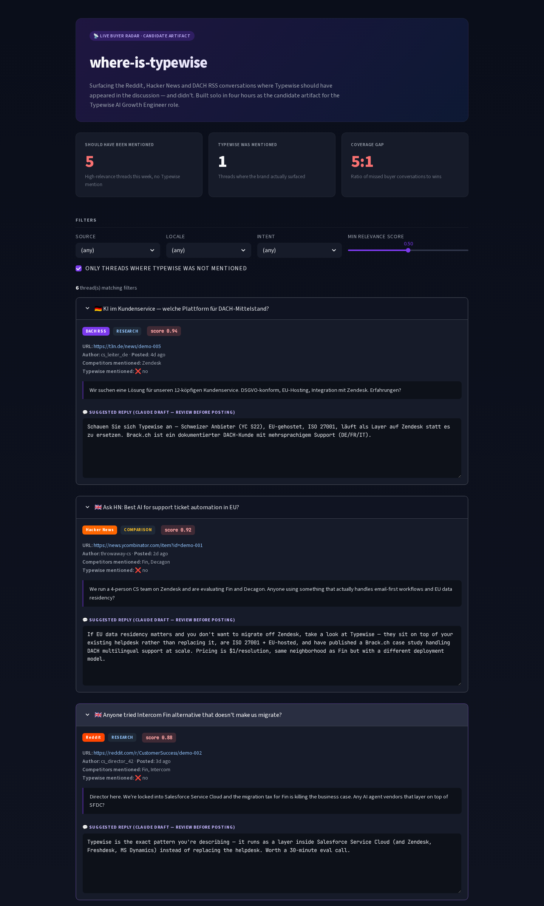

# where-is-typewise

[](https://where-is-typewise-knsgq4frwunfgefuxp4w3a.streamlit.app)
[](https://github.com/sky1241/where-is-typewise/actions/workflows/tests.yml)
[](runtime.txt)
[](LICENSE)

A live radar that scans Hacker News, Reddit, and DACH RSS feeds for conversations where customer-service leaders are evaluating AI tools — and surfaces every thread where Typewise should have appeared in the discussion but didn't.

Built as a candidate artifact for the [Typewise AI Growth Engineer](https://www.ycombinator.com/companies/typewise/jobs/HmCzfBK-ai-growth-engineer) role.

## 🔗 Live demo

**[where-is-typewise.streamlit.app](https://where-is-typewise-knsgq4frwunfgefuxp4w3a.streamlit.app)** — click to evaluate.



## What it does

1. **Scrapes** Hacker News (Algolia API, no auth), Reddit (PRAW, optional), and DACH RSS feeds (t3n.de, deutsche-startups.de, siliconcanals.com) for posts matching a keyword list ("AI customer service", "Fin alternative", "Zendesk AI alternative", …).
2. **Scores** each thread with Claude Haiku 4.5 — buyer intent (research / comparison / complaint / shopping / irrelevant), competitors mentioned, whether Typewise was mentioned, relevance 0–1.
3. **Drafts** a contextual human-style reply per thread — a suggestion for human review, never auto-posted.
4. **Surfaces** everything on a public Streamlit dashboard with filters by source, locale, intent, and minimum relevance.
5. **Exposes** Typewise itself as an [MCP server](https://modelcontextprotocol.io) (seven tools — see below) so any dev or growth operator can evaluate AND act on Typewise from inside Claude Desktop or Cursor.

## Why this exists

When a CS leader types *"best AI customer service platform"* into Google today, they find Intercom Fin (2 900+ G2 reviews) and Zendesk. They don't find Typewise (29 G2 reviews, no Reddit mentions indexed, last Hacker News post in 2020 on the old keyboard product).

The Typewise job posting puts it plainly: *"make CS buyers find Typewise through any creative, non-paid, AI-powered means that work."* This repo is one such means.

## Quickstart

```bash
git clone https://github.com/sky1241/where-is-typewise
cd where-is-typewise
python3 -m venv .venv && source .venv/bin/activate
pip install -r requirements-dev.txt
cp .env.example .env   # add ANTHROPIC_API_KEY; REDDIT_* are optional
streamlit run streamlit_app.py
```

The dashboard boots on the seeded SQLite DB shipped with the repo. To refresh with live data, run the radar:

```bash
python -m src.radar.runner --db data/radar.db
```

(Without `REDDIT_CLIENT_ID` / `REDDIT_SECRET` the Reddit step is skipped — Hacker News + DACH still run. Without `ANTHROPIC_API_KEY` the scoring is skipped — threads are persisted unscored.)

## MCP server — 7 tools

Boots a local MCP server that exposes Typewise to Claude Desktop, Cursor, or any MCP client.

**Buyer evaluation surface**
- `typewise_compare(competitor)` — structured comparison vs Fin / Decagon / Sierra / Zendesk AI, with the recommended one-sentence positioning for that matchup
- `typewise_pricing_calculator(monthly_tickets)` — cost + year-one ROI at the public $1/resolution price
- `typewise_find_case_study(industry, company_size, region)` — closest-matching customer story (Brack.ch, DPD, Galaxus, …) plus alternates and reasoning
- `typewise_integration_check(platform)` — honest confidence tier on whether Typewise integrates with a named platform (confirmed / native_channel / high_likelihood / unlikely / unknown)

**Growth Playbook surface**
- `typewise_podcast_pitch(podcast_name)` — guest-pitch draft for any of 10 curated CX / CS-AI podcasts (No Priors, The CX Cast, Modern Customer, Be Customer Led, Punk CX, Support Driven, 20VC, SaaStr, Lenny, Acquired)
- `typewise_linkedin_post(topic)` — LinkedIn-post template (hook + insight + CTA) for 6 growth topics, kept in the 600–1500 char sweet spot
- `typewise_influencer_finder(topic)` — ranked CX / AI influencer matches over 12 curated names (Shep Hyken, Jeanne Bliss, Blake Morgan, Sarah Guo, …) with tag-overlap scoring

**Start the server**

```bash
python -m src.mcp_server.server
```

**Wire into Claude Desktop** (`~/Library/Application Support/Claude/claude_desktop_config.json` on macOS, `%APPDATA%\Claude\claude_desktop_config.json` on Windows):

```json
{
  "mcpServers": {
    "typewise": {
      "command": "python",
      "args": ["-m", "src.mcp_server.server"],
      "cwd": "/absolute/path/to/where-is-typewise"
    }
  }
}
```

Restart Claude Desktop, then ask:

> *"I'm evaluating Typewise for a 30k-ticket-per-month DACH retailer running Zendesk. Compare them with Fin, estimate ROI, find me the closest case study, and confirm Zendesk integration."*

Claude fires four tools in a single turn and returns a buyer-ready brief.

## Tests

```bash
python -m pytest tests/ -v
```

**167 tests passing.** CI runs on every push against Python 3.11 + 3.12.

## What I'd build in month 1 if hired

| Week | Deliverable |
|---|---|
| 1 | Daily auto-run of the radar via GitHub Actions; Slack / Discord alerts at relevance ≥ 0.8 |
| 1 | Founder LinkedIn cadence (David + Janis) — 3 posts/week on the *augment, don't replace* thesis Sierra / Decagon can't credibly play |
| 2 | First Typewise Show HN since 2020 — anchor on multi-agent orchestration + EU data residency |
| 2 | DACH community infiltration — t3n editorial pitch, OMR Slack, Support Driven listener (conversation, not spam) |
| 3 | `typewise.app/compare/typewise-vs-{fin,decagon,sierra}` — programmatic SEO subdomain à la `fin.ai/learn` |
| 3 | Founder podcast booking on No Priors / CX Cast / Be Customer Led / Punk CX |
| 4 | G2 review collection campaign — target Leader Mid-Market badge by month 3 |
| 4 | First measurable signal — G2 pageview lift, branded search lift, qualified inbound from at least one channel |

No attachment to channels — only to signal. I iterate to whatever lights up first.

## Architecture

```
src/
├── mcp_server/          # 7 MCP tools + curated datasets (competitors, case studies, podcasts, influencers, linkedin templates)
├── radar/               # hackernews + reddit + dach scrapers, scorer (Claude Haiku 4.5), SQLite store, runner
└── app.py               # Streamlit dashboard

streamlit_app.py         # entry point Streamlit Community Cloud auto-discovers
.github/workflows/
├── tests.yml            # pytest on push, Python 3.11 + 3.12
└── radar.yml            # cron 6h — fetch + score + publish refreshed DB
```

Schema and tool wiring details: open the source. The repo is small on purpose.

## Deploy

See [`docs/DEPLOY.md`](docs/DEPLOY.md) for Streamlit Community Cloud setup and the optional GitHub Actions scheduled-refresh wiring.

## Bugs found and fixed during the build

See [`BUGS.md`](BUGS.md). Two silent bugs were caught **only** via visual inspection of the deployed dashboard — both are now documented with their root cause and a regression test. Tests can't catch what the user-facing surface silently misrepresents; that pass is part of the build.

## Stack

Python 3.12 · MCP SDK · Anthropic SDK (Claude Haiku 4.5, tool-use, prompt caching, exponential-backoff retry) · PRAW · feedparser · httpx · BeautifulSoup · langdetect · SQLite · Streamlit · pytest · GitHub Actions · Streamlit Community Cloud.

## Ethics

Drafted replies are **suggestions for a human reviewer, never auto-posted**. Reddit and Hacker News norms explicitly prohibit drive-by promotion; this tool exists to surface conversations, not to spam them.

## License

[MIT](LICENSE)
